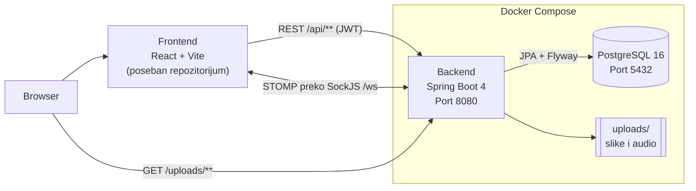
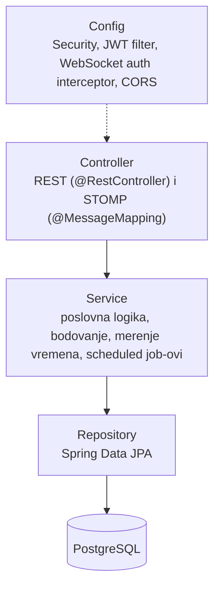
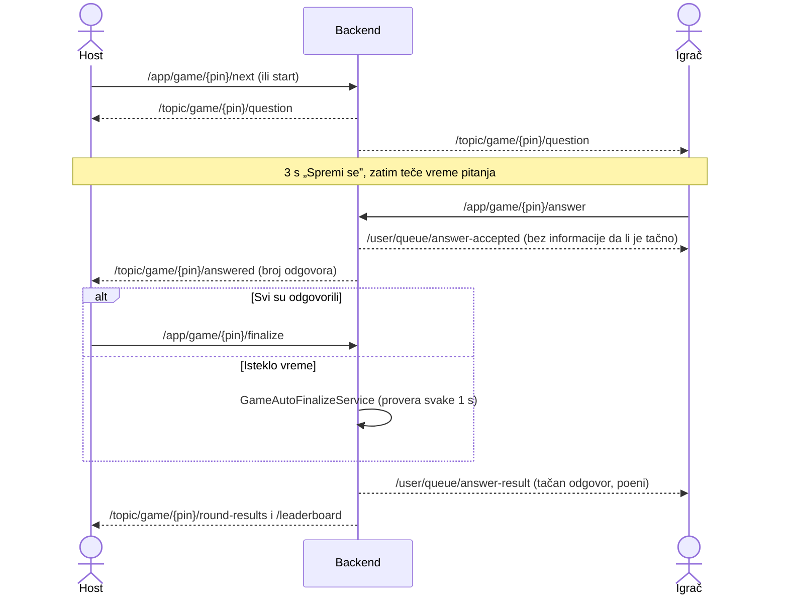
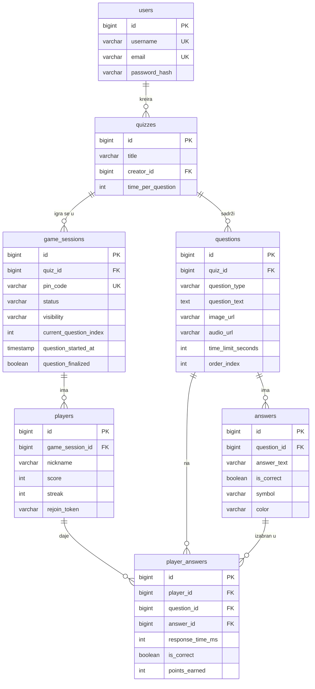

# Kahoot Backend

Backend za Kahoot-like aplikaciju za kvizove uživo. Registrovani korisnici prave kvizove (tekst, slike, audio) i pokreću partije sa PIN kodom. Igrači ulaze bez naloga i odgovaraju u realnom vremenu preko WebSocket-a, a poeni zavise od brzine i niza tačnih odgovora.

Aplikacija je napisana u Spring Boot-u (Java 21), podatke čuva u PostgreSQL bazi, a real-time komunikaciju radi preko STOMP-a (WebSocket + SockJS). Frontend je poseban React projekat: [kahoot-frontend](https://github.com/Dumanex/kahoot-frontend).

## Funkcionalnosti

- **Registracija i prijava**: JWT autentikacija, lozinke se čuvaju kao BCrypt hash
- **Kvizovi i pitanja**: CRUD kvizova i pitanja. Četiri tipa pitanja (`MULTIPLE_CHOICE`, `TRUE_FALSE`, `IMAGE_RECOGNITION`, `AUDIO`), svako sa 2–4 odgovora (simbol i boja kao u Kahoot-u)
- **Upload medija**: slike (`jpg`, `jpeg`, `png`, `gif`, `webp`) i audio (`mp3`, `wav`, `ogg`, `m4a`) do 20 MB, serviraju se na `/uploads/...`
- **Partije sa PIN kodom**: host pravi partiju od svog kviza i dobija nasumičan 6-cifreni PIN. Partija može biti javna ili privatna, a javne se mogu pretraživati
- **Igrači bez naloga**: ulaze samo sa PIN-om i nadimkom i dobijaju `rejoinToken` za povratak
- **Igra u realnom vremenu**: pitanja, broj odgovora, rezultati runde, rang-lista i kraj igre stižu preko STOMP poruka
- **Bodovanje**: tačan odgovor donosi `1000 + do 500 za brzinu + 50 × trenutni niz` poena
- **Automatska finalizacija**: server svake sekunde proverava da li je nekom pitanju isteklo vreme i sam ga zatvara, pa igra teče i ako hostu zaspi tab
- **Povratak posle osvežavanja stranice**: igrač (`rejoin` + `state`) i host (`/api/games/mine` + `state`) mogu da nastave partiju
- **Istorija partija**: host vidi svoje partije koje su u toku i završene
- **Čišćenje napuštenih partija**: nepokrenute partije starije od 30 min se brišu, a partije u toku bez promene pitanja 2 h se završavaju

## Arhitektura

### Infrastruktura



Frontend sa backendom razgovara na dva načina:
- **REST** za sve što nije real-time: nalog, kvizovi, upload, pravljenje partije i ulazak u nju, stanje partije posle osvežavanja stranice.
- **WebSocket (STOMP)** za samu igru: server šalje pitanja i rezultate svima u partiji (`/topic/...`) ili jednom igraču (`/user/queue/...`), a igrači šalju odgovore.

Broker poruka je Spring-ov ugrađeni *simple broker* (u memoriji), pa nije potreban poseban servis kao RabbitMQ. Otpremljeni fajlovi se čuvaju na disku (u Docker-u na volume-u) i backend ih servira kao statičke fajlove.

### Slojevi backenda



Kontroleri ne pristupaju repozitorijumima direktno, sve ide kroz servisni sloj. WebSocket poruke se šalju tek posle uspešnog commit-a transakcije, pa klijent nikada ne dobije stanje koje je kasnije poništeno.

### Tok jednog pitanja



## Tehnologije

| Tehnologija | Verzija | Namena |
|---|---|---|
| Java | 21 | Jezik |
| Spring Boot | 4.1.0 | Osnova aplikacije (Web MVC, Validation) |
| Spring Security | (iz Spring Boot-a) | Autentikacija i autorizacija, CORS |
| Spring WebSocket (STOMP + SockJS) | (iz Spring Boot-a) | Komunikacija u realnom vremenu |
| Spring Data JPA / Hibernate | (iz Spring Boot-a) | Pristup bazi |
| Flyway | (iz Spring Boot-a) | Migracije šeme baze |
| PostgreSQL | 16 (Docker image `postgres:16-alpine`) | Baza podataka |
| JJWT | 0.12.3 | Pravljenje i provera JWT tokena |
| springdoc-openapi | 3.1.1 | Swagger UI i OpenAPI specifikacija |
| Lombok | (iz Spring Boot-a) | Manje ponavljajućeg koda (getteri, builderi, konstruktori) |
| Maven Wrapper | Maven 3.9.16 | Build, bez lokalne instalacije Maven-a |
| JUnit 5, Mockito, Spring Test | (iz Spring Boot-a) | Testovi |
| H2 | (iz Spring Boot-a) | Baza u memoriji za testove |
| Docker / Docker Compose | – | Pokretanje baze i celog sistema |

## Struktura projekta

```
kahoot-backend/
├── src/main/java/com/kahoot/kahoot_backend/
│   ├── config/          # SecurityConfig, WebSocketConfig, JWT filter, WebSocket auth interceptor, OpenAPI, scheduling
│   ├── controller/      # AuthController, QuizController, QuestionController, UploadController,
│   │                    # GameController (REST), GameWebSocketController (STOMP)
│   ├── DTOs/            # Request/response objekti (auth, quiz, game, upload)
│   ├── enums/           # QuestionType, GameSessionStatus, GameSessionVisibility, AnswerColor, ...
│   ├── exception/       # Sopstveni izuzeci i GlobalExceptionHandler (jedinstven JSON format greške)
│   ├── model/           # JPA entiteti: User, Quiz, Question, Answer, GameSession, Player, PlayerAnswer
│   ├── repository/      # Spring Data JPA repozitorijumi
│   └── service/         # Poslovna logika: GameService, PlayerService, ScoringService, QuestionTiming,
│                        # GameMessageService (slanje STOMP poruka), GameAutoFinalizeService, GameCleanupService, ...
├── src/main/resources/
│   ├── application.yml  # Konfiguracija (vrednosti dolaze iz env varijabli)
│   ├── logback-spring.xml
│   └── db/migration/    # Flyway migracije V1–V5
├── src/test/            # JUnit testovi i application-test.yaml (H2)
├── Dockerfile           # Multi-stage build: Maven build → JRE image
├── docker-compose.yml   # PostgreSQL + backend (profil "prod")
├── .env.example         # Šablon za environment varijable
├── DEPLOYMENT.md        # Uputstvo za produkciju
└── mvnw, mvnw.cmd       # Maven Wrapper
```

## Preduslovi

- [JDK 21](https://adoptium.net/) (varijabla `JAVA_HOME` treba da pokazuje na JDK 21)
- [Docker](https://www.docker.com/get-started) sa Docker Compose v2 (za PostgreSQL, ili za ceo sistem)
- Git

Maven nije potreban jer projekat koristi Maven Wrapper (`mvnw` / `mvnw.cmd`). Ako se ceo sistem pokreće kroz Docker, nije potreban ni JDK.

## Lokalno pokretanje

### 1. Kloniranje repozitorijuma

```bash
git clone https://github.com/Dumanex/kahoot-backend.git
cd kahoot-backend
```

### 2. Environment varijable

```bash
cp .env.example .env
```

U `.env` obavezno upisati `JWT_SECRET` (bilo koji string od najmanje 32 karaktera). Ostale vrednosti iz šablona odgovaraju lokalnom razvoju. Opis svih varijabli je u sekciji [Environment varijable](#environment-varijable).

### 3. Pokretanje baze

```bash
docker compose up -d postgres
```

Ova komanda podiže PostgreSQL 16 na portu `5432` sa bazom `kahoot`. Šemu pravi Flyway pri prvom pokretanju backenda.

### 4. Pokretanje backenda

Spring Boot ne čita `.env` fajl sam, pa varijable treba učitati u shell pre pokretanja.

Linux / macOS / Git Bash:

```bash
set -a && . ./.env && set +a
./mvnw spring-boot:run
```

Windows PowerShell:

```powershell
Get-Content .env | Where-Object { $_ -match '^\s*[^#].*=' } | ForEach-Object {
    $name, $value = $_ -split '=', 2
    Set-Item -Path "env:$($name.Trim())" -Value $value.Trim()
}
.\mvnw.cmd spring-boot:run
```

U IntelliJ IDEA je dovoljno dodati `JWT_SECRET` u *Run Configuration → Environment variables*. Za ostale varijable postoje podrazumevane vrednosti za lokalni razvoj.

### 5. Provera

Backend radi na **http://localhost:8080**:

- Swagger UI: http://localhost:8080/swagger-ui.html
- OpenAPI specifikacija (JSON): http://localhost:8080/v3/api-docs

### Alternativa: ceo sistem u Docker-u

```bash
docker compose --profile prod up -d --build
```

Ova komanda builduje backend image (Maven build se radi unutar Docker-a) i podiže bazu i backend. Otpremljeni fajlovi se čuvaju na volume-u `uploads-data`. Zaustavljanje:

```bash
docker compose --profile prod down
```

`docker compose --profile prod down -v` briše i volume-e, odnosno **sve podatke iz baze i otpremljene fajlove**.

## Environment varijable

| Naziv | Opis | Podrazumevano | Primer |
|---|---|---|---|
| `JWT_SECRET` | Ključ za potpisivanje JWT tokena (HMAC). Običan string od **najmanje 32 bajta**, inače aplikacija ne startuje. **Obavezno** | – | izlaz komande `openssl rand -base64 48` |
| `JWT_EXPIRATION` | Trajanje tokena u milisekundama | `86400000` (24 h) | `86400000` |
| `DB_HOST` | Host PostgreSQL servera (u Docker Compose-u backend dobija `postgres`) | `localhost` | `localhost` |
| `DB_PORT` | Port PostgreSQL servera | `5432` | `5432` |
| `DB_NAME` | Naziv baze | `kahoot` | `kahoot` |
| `DB_USERNAME` | Korisnik baze | `postgres` | `postgres` |
| `DB_PASSWORD` | Lozinka korisnika baze | `postgres` | `<jaka-lozinka>` |
| `CORS_ALLOWED_ORIGINS` | Origin-i frontenda kojima je dozvoljen pristup REST API-ju i `/ws`, razdvojeni zarezom, bez `/` na kraju | `http://localhost:63342,http://localhost:8080,http://localhost:5173` | `https://kviz.example.com` |
| `UPLOAD_DIR` | Folder u koji se čuvaju otpremljeni fajlovi (u Docker-u: `/app/uploads`) | `./uploads` | `./uploads` |
| `UPLOAD_BASE_URL` | Javni URL backenda, koristi se za pravljenje linkova ka otpremljenim fajlovima | `http://localhost:8080` | `https://api.kviz.example.com` |

Podrazumevane vrednosti su u `src/main/resources/application.yml`, a šablon je u `.env.example`. Fajl `.env` je u `.gitignore` i ne sme se commit-ovati.

## Baza podataka

- **Kreiranje**: PostgreSQL se podiže kroz `docker compose up -d postgres`. Baza `kahoot` i korisnik se prave automatski iz `DB_NAME` / `DB_USERNAME` / `DB_PASSWORD`, i to samo pri prvom kreiranju volume-a `postgres-data`.
- **Migracije**: šemu vodi **Flyway**, koji pri svakom startu backenda primenjuje nove migracije iz `src/main/resources/db/migration/`. Hibernate je podešen na `ddl-auto: validate`, pa samo proverava da li se entiteti poklapaju sa šemom i nikad je ne menja.

  | Migracija | Sadržaj |
  |---|---|
  | `V1__create_initial_schema.sql` | Tabele `users`, `quizzes`, `questions`, `answers`, `game_sessions`, `players`, `player_answers` i indeksi |
  | `V2__add_version_to_players.sql` | Kolona `version` za optimističko zaključavanje igrača |
  | `V3__add_unique_constraint_player_answers.sql` | Jedan odgovor po igraču po pitanju |
  | `V4__add_visibility_to_game_sessions.sql` | Javne i privatne partije |
  | `V5__add_reconnect_fields.sql` | `rejoin_token` igrača, vreme početka i status finalizacije pitanja |

- **Početni podaci**: ne postoje. Nalog se pravi preko `POST /api/auth/register`, a kviz preko API-ja ili frontenda.



## Pregled API-ja

Kompletna REST dokumentacija sa šemama zahteva i odgovora je u **Swagger UI**: http://localhost:8080/swagger-ui.html. Za endpointe sa JWT-om kliknuti *Authorize* i uneti token iz `/api/auth/login`.

Zaštićeni endpointi zahtevaju header `Authorization: Bearer <token>`. Greške imaju isti JSON oblik: `timestamp`, `status`, `error`, `message`, `path`.

### REST

| Metoda | Putanja | JWT | Opis |
|---|---|---|---|
| POST | `/api/auth/register` | – | Registracija (`username`, `email`, `password`), vraća token |
| POST | `/api/auth/login` | – | Prijava (`username`, `password`), vraća token |
| GET | `/api/quizzes` | ✔ | Kvizovi prijavljenog korisnika (paginacija) |
| POST | `/api/quizzes` | ✔ | Novi kviz |
| GET | `/api/quizzes/{id}` | ✔ | Jedan kviz sa pitanjima |
| PUT | `/api/quizzes/{id}` | ✔ | Izmena kviza |
| DELETE | `/api/quizzes/{id}` | ✔ | Brisanje kviza |
| GET | `/api/quizzes/{quizId}/questions` | ✔ | Pitanja kviza |
| POST | `/api/quizzes/{quizId}/questions` | ✔ | Novo pitanje sa 2–4 odgovora |
| PUT | `/api/questions/{id}` | ✔ | Izmena pitanja |
| DELETE | `/api/questions/{id}` | ✔ | Brisanje pitanja |
| POST | `/api/upload?type=image\|audio` | ✔ | Upload fajla (`multipart/form-data`, polje `file`), vraća `{ "url": ... }` |
| GET | `/uploads/{image\|audio}/{fajl}` | – | Otpremljeni fajl |
| POST | `/api/games/host` | ✔ | Nova partija (`quizId`, `visibility`), vraća PIN |
| POST | `/api/games/{pinCode}/start` | ✔ | Pokretanje partije (samo host) |
| POST | `/api/games/{pinCode}/next` | ✔ | Sledeće pitanje (samo host) |
| POST | `/api/games/{pinCode}/end` | ✔ | Kraj partije (samo host) |
| GET | `/api/games/mine` | ✔ | Partije hosta (u toku i istorija) |
| GET | `/api/games/public?q=` | – | Javne partije koje čekaju igrače, sa pretragom |
| GET | `/api/games/{pinCode}` | – | Osnovni podaci o partiji |
| POST | `/api/games/{pinCode}/join` | – | Ulazak igrača (`nickname`), vraća `playerId` i `rejoinToken` |
| POST | `/api/games/{pinCode}/rejoin` | – | Povratak igrača posle osvežavanja stranice (`playerId`, `rejoinToken`) |
| GET | `/api/games/{pinCode}/state` | – | Trenutno stanje partije (pitanje, vreme, rezultati, rang-lista) |

### WebSocket (STOMP)

Konekcija: SockJS endpoint `/ws`. Klijent šalje na `/app/...`, a prima sa `/topic/...` (svi u partiji) i `/user/queue/...` (samo taj klijent).

Autentikacija se radi u STOMP `CONNECT` frame-u:
- **Host** šalje header `Authorization: Bearer <token>`. Nevažeći token prekida konekciju.
- **Igrač** šalje header-e `playerId` i `rejoinToken`, pa prima i privatne poruke.

| Smer | Destinacija | Opis |
|---|---|---|
| Klijent → server | `/app/game/{pin}/answer` | Igrač šalje odgovor (`playerId`, `rejoinToken`, `questionId`, `answerId`) |
| Klijent → server | `/app/game/{pin}/start`, `/next`, `/end` | Host komande (isto kao REST varijante) |
| Klijent → server | `/app/game/{pin}/finalize` | Host zatvara pitanje pre isteka vremena |
| Server → svi | `/topic/game/{pin}/players` | Spisak igrača posle ulaska novog igrača |
| Server → svi | `/topic/game/{pin}/started` | Igra je počela |
| Server → svi | `/topic/game/{pin}/question` | Novo pitanje (bez oznake tačnog odgovora) + serversko vreme za tajmer |
| Server → svi | `/topic/game/{pin}/answered` | Koliko je igrača odgovorilo |
| Server → svi | `/topic/game/{pin}/round-results` | Rezultati runde za sve igrače |
| Server → svi | `/topic/game/{pin}/leaderboard` | Rang-lista |
| Server → svi | `/topic/game/{pin}/ended` | Kraj igre i konačna rang-lista |
| Server → jedan | `/user/queue/answer-accepted` | Potvrda da je odgovor primljen |
| Server → jedan | `/user/queue/answer-result` | Rezultat igrača posle finalizacije pitanja |
| Server → jedan | `/user/queue/errors` | Greška za komandu tog klijenta |

## Testovi

Testovi koriste H2 bazu u memoriji (profil `test`, `src/test/resources/application-test.yaml`), pa za njih **nije potrebna** PostgreSQL baza ni `.env`.

```bash
./mvnw test
```

Jedna test klasa (PowerShell zahteva navodnike oko `-D` argumenta):

```bash
./mvnw test -Dtest=GameServiceTest
```

```powershell
.\mvnw.cmd test "-Dtest=GameServiceTest"
```

Trenutno ima 224 testa:

| Vrsta | Paket | Šta se testira |
|---|---|---|
| Unit testovi (Mockito) | `service/` | Poslovna logika: tok igre, bodovanje, merenje vremena, auto-finalizacija, čišćenje, JWT, upload |
| Repository testovi (`@DataJpaTest`) | `repository/` | Upiti i ograničenja nad bazom |
| Controller testovi (`@WebMvcTest`) | `controller/` | REST endpointi, validacija, statusni kodovi, bezbednost |
| WebSocket testovi | `controller/`, `config/` | STOMP kontroler i autentikacija u `CONNECT` frame-u |
| Obrada grešaka | `exception/` | `GlobalExceptionHandler` |
| Integracioni | root | Podizanje celog Spring konteksta |

## Produkcija

Postavljanje na server je opisano korak po korak u **[DEPLOYMENT.md](DEPLOYMENT.md)**.

## Frontend

React + Vite aplikacija: **https://github.com/Dumanex/kahoot-frontend**

## Autor

**Vladimir Dumanovic** – [github.com/Dumanex](https://github.com/Dumanex)
